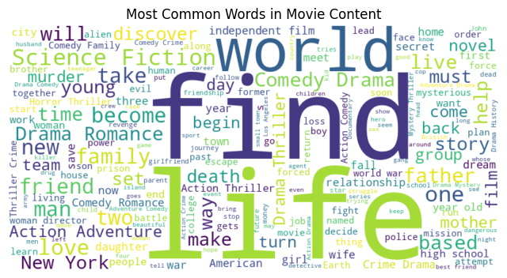

# movie-recommendation-app
Its a Movie Recommendation build on an ML model to recommend user a movie based on their selection.

---

🛠 Tools Used

- Python
- Streamlit
- OMDb
- joblib
- nltk
- Sikit-learn

---

🔍 Project Objective

To find the top 5 movies most similar to the one selected by user by using their genre and discription.I used cosine similarity model to obtain the result.

---

📸 Visualizations

# 1. Most Common Words in Movies   

# 2. Website  

